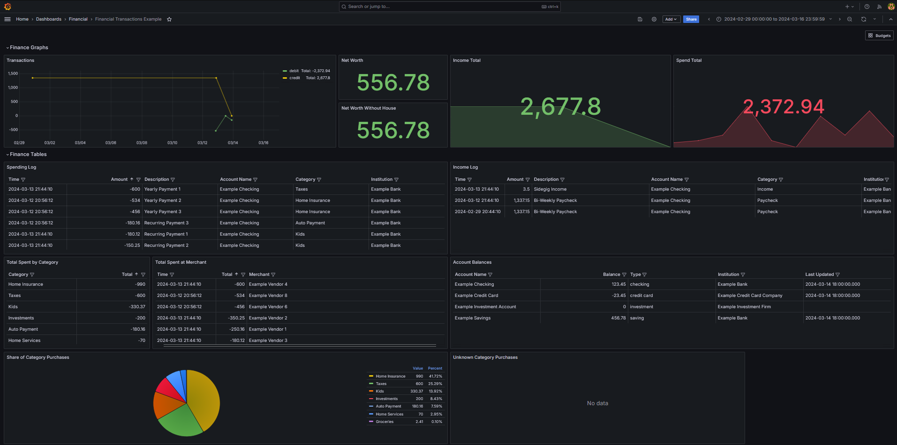
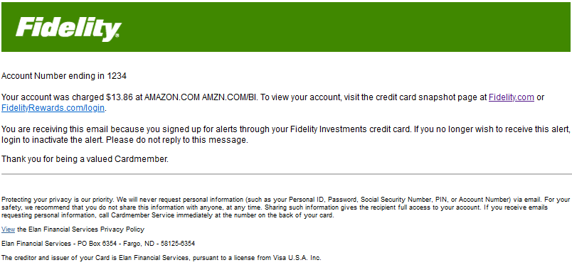

# Transaction Importer

Import financial transaction logs from emailed alerts and inject them into a database. Once they are in the database
they can be cataloged and displayed by a front end such as Grafana.

## Setup
### Email
For Gmail, you will need to enable app passwords to access your gmail via IMAP. A link to instructions is [here](https://support.google.com/accounts/answer/185833).
Once you have the credentials, you can add them to a .env file.

I supplied an example .env file, fill it out with the required fields, and optional fields as you see fit.

You will also need the name of the Label (Gmail Folder) of your transactions. I have all my transactions filtered into a
folder in Gmail and tagged with a Label. That isolates the transactions and allows me to set an IMAP watcher to trigger 
this importer to run whenever a new transaction appears in Gmail. With this setup, I can automatically import new 
transactions within seconds of swiping my card.

You could probably use another email client, as this project is built around IMAP. I haven't tried it, but it should work.

### Banks and Credit Cards
You'll need to configure your financial accounts to send you alerts whenever a transaction occurs. Most places have this
as a mechanism for keeping tabs on secondary account users. Some places also have the ability to send you daily balance
notifications, which can also be parsed and inserted into finance_accounts table.

## Running

1. Run the docker-compose.yml running `docker compose up -d`
2. Browse to http://localhost:3000 to see the Grafana dashboard.
   * admin/password
   * Click the hamburger in the upper left, click Dashboards, click Financial Transactions
3. Browse to http://localhost:5010 to see the simple landing page
   * Clicking Run Transaction Import will trigger an IMAP call to Gmail to import your transactions into the database.

**Note**
There is a good chance that the import will fail for your bank. There are parsers per-bank that extract the transaction
information out of the email. Every bank structures the contents of their email differently. This would be an excellent
opportunity for a ML model to extract the information from the email. But for now...
You'll have to [write your own parser](https://github.com/bckelly1/transaction_importer/tree/master/src/institution_parser).

## Background
This started when Intuit shut down Mint. I was already unhappy that Mint was unable to handle my 2FA for my bank accounts
and I had to manually trigger the import every time I wanted a break down of my balances. I tried many of the popular
budget apps to mixed results, but I found that I wanted a simpler interface with minimal hand holding and straightforward
displays.

This application relies on you to set up transaction and balance notifications to be emailed to you on an individual basis.
This can typically be accomplished with every bank and financial institution, though European banks sometimes have the
benefit of an API to work with. My setup has all banks, credit cards, and investment firms forwarding all transactions
and daily balance reports to my email. 

My email has a filter set up to label all those emails and move them out of the 
inbox but leave them unread. I have Home Assistant running an IMAP watcher on that label which then calls the URL for
this application, triggering the reading, parsing, and importing of the transaction email. The parsed transaction is
then inserted into a database for Grafana to read and display. Grafana has immense data search capabilities and is a
perfect candidate for viewing a financial transaction report.

## Front End
The theory right now is that the transactions are dropped into a database which can then be queried by any front end. I
connected a Grafana instance to a MySQL database and developed some dashboards to display the transactions in a logical
format.

The files for the Grafana dashboards are under examples/dashboards/

I tried my best to write a useful dashboard, but it is definitely catered to my use case.

## Internal Details
This application is actually a spinoff of a much larger application. I tried to make it as isolated and single-purpose as
I could but if you find something weird do let me know.

There are 4 main areas:
* The email parser - this largely assumes the email will be an HTML doc embedded in an email. Most of them are. Most of
them are incredibly clunky. Each bank will have to be manually parsed. I tried to write or find a ML template to do it
for me but I came up empty. As such...
* The category parser - this one is a doozy. It's very manual. It searches the text of the transaction and attempts to
label the transaction into one of 130+ categories. It is basically an enormous If/Else block. Again I tried ML on this
but I couldn't get it to cooperate. It doesn't help that every branch of every chain of stores can use their own
identifier for their credit card transaction. If the transaction doesn't match the If block, it will mark it as Uncategorized.
* The database - I tried to keep this fairly simple. Institutions have accounts, accounts can have transactions,
transactions have categories, and transactions apply to vendors.
* The UI - Flask based. I wanted to learn Python and I've already done Django a little bit so I wanted to try something
more light-weight. I'm not totally sold on Flask, I don't even think I'm doing it right.

## Contributions
Any and all Contributions are welcome. This started as a hobby project and might be a little clunky.
